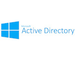

##LDAP NOTES - MONGODB BOOTCAMP

+++

### Resources

[github repo - https://github.com/manfontan/mongodb-bootcamp](https://github.com/manfontan/mongodb-bootcamp)  

[online slides - https://gitpitch.com/manfontan/mongodb-bootcamp](https://gitpitch.com/manfontan/mongodb-bootcamp)  

---

### What is LDAP?  
LDAP stands for Lightweight Directory Access Protocol.

+++

  - **L**: lightweight, why?
    - Even though the “lightweight” moniker is primarily intended as a comparison to its predecessor, the X.500 ([ISO/IEC 9594-1](http://www.itu.int/rec/T-REC-X.500-201210-S)) Directory Access Protocol, LDAP really is lightweight compared with just about any other TCP-based protocols.

+++

  - **D**: directory, what is it?
    - A directory is a specialized database specifically designed for searching and browsing, in additional to supporting basic lookup and update functions.
    - The Directory is "a collection of open systems cooperating to provide
 directory services"
    - [RFC 4512](https://tools.ietf.org/pdf/rfc4512.pdf)


Note: NoSQL database actually :).

+++

  - **AP**: Access Protocol  
    - not server as many refer to it.  
    - [IETF](http://www.ietf.org/) Standard Track protocol and is specified in "Lightweight Directory Access Protocol (LDAPv3) Technical Specification Road Map" [RFC4510](http://www.rfc-editor.org/rfc/rfc4510.txt)  

    **Understand the protocol to solve server issues**

+++

### Why does MongoDB support LDAP?

- Widely deployed in companies all over the world.

+++  
### Why does Companies use LDAP?

  - Information for an entire organization can be consolidated into a central repository.
  - Well-defined client Application Programming Interface (API), the number of LDAP-enabled applications are numerous and increasing in quantity and quality.
  - Lightweight  
  - Public Standard [rfc4510](https://tools.ietf.org/pdf/rfc4510.pdf)  
  - Mature  
  - Security

Note:
  - binary ASN.1 syntax that is used to encode LDAP messages is both very compact and very efficient to parse, especially when compared with text-based protocols like HTTP where the data being transferred is often further bloated by being formatted in XML or JSON.
  - 2048 certs are ok, since they are renewed yearly. 4096 Certs slow the
  handshake process and might lead to issues.
  - LDAP has been around since the early 1990s and is a simplified subset of X.500 which has been around since the 1980s.
  - Support to automatically encoding passwords with one-way digests or encryption  
  this make it easy to authenticate users while makes it very difficult to determine  
  what their clear-text credentials really are.(Not used by mongodb).
  - Support extensible authentication via SASL framework. (Non password based, Kerberos...).
  - Support for password policy features (expiration, quality validation, account lockout ...).
  - Fine-grained access control.

+++

### How does a Directory look?

- **Directory Information Tree** tree-like representation of the directory data  
consisting of Distinguished Names ad directory services.

Note:
- directory service: It is a shared information infrastructure for locating, managing, administering and organizing everyday items and network resources, which can include volumes, folders, files, printers, users, groups, devices, telephone numbers and other objects.

+++?image=assets/intro_dctree.png

+++

### Identifying tree elements?

  - **DN (Distinguished Name)**: uniquely identifies an entry and describes its position in the tree.
    - `'uid=manuel.fontan, ou=server, o=mongodb, dc=com'`
    - [RFC 4514](https://tools.ietf.org/pdf/rfc4514.pdf)

  - **RDN (Relative DN)**: zero or more comma-separated components that comprise a DN.
    - uid=manuel.fontan
    - ou=server
    - o=mongodb
    - dc=com

Note:
 - Each RDN is comprised of name-value pairs. Every RDN must contain at least one pair.
 - Even though each component of a DN is in itself an RDN, it is a common practice to refer to the leftmost component of an entry's DN as the RDN for that entry, and to refer to the attributes included in that RDN component as naming attributes. Ex: uid=manuel.fontan
 - The null DN may be used to reference a special entry called the root DSE, which provides a lot of useful information about the directory server

+++

 **String representation of a DN**:  
 A DN might have multiple string representations.  
 All of the following are valid ways of representing the same DN:
```
    dc=mongodb,dc=com
    dc=mongodb, dc=com
    dc = mongodb , dc = com
    DC=MONGODB,DC=COM
    0.9.2342.19200300.100.1.25=MongoDB,0.9.2342.19200300.100.1.25=Com
```  
Note:
- You need to be very careful to take this in account when trying to compare DNs.

+++

### LDAP flavors  

[Server implementations](https://en.wikipedia.org/wiki/List_of_LDAP_software#Server_software)




  

  Microsoft AD  
  [Openldap](http://www.openldap.org/)  
  [389 Directory Server](http://directory.fedoraproject.org/)  
  [OpenDJ](https://backstage.forgerock.com/docs/opendj/2.8.0/server-dev-guide/preface)  
  [ApacheDS](http://directory.apache.org/apacheds/)

---

### MongoDB and LDAP

  - **Authentication**
  - **Authorization**

+++

  - Authentication (available since 3.2)
    - Proxy auth using saslauthd
    - Direct auth using OS LDAP libraries (new on 3.4)
    - [M310 Chapter 1](https://university.mongodb.com/courses/MongoDB/M310/2017_ondemand_v32/courseware/Chapter_1_Authentication)

Note:
- LDAP for 3.2 is only available using saslathd daemon(Unix only).

+++

  - Authorization (new on 3.4)
    - [M034 Chapter 3](https://university.mongodb.com/mercury/M034/2016_ondemand_v1/courseware/Chapter_3_LDAP_Authorization)


+++

  - Authorization Steps
    - Authentication: Kerberos, LDAP, X509 (```$external database```)
    - Transformation:  
    In order to match the credential formats between the authentication and authorization mechanisms, the user credentials may require a transformation step.
    - Query
    - Validation

Notes:
- managing existing users.
  - User has a corresponding user object on LDAP server.
  - User exist on the ```$external``` database with equivalent roles and privileges
  - Or include SCRAM-SHA-1

+++

  - Understanding [MongoDB LDAP configuration](https://docs.mongodb.com/manual/core/security-ldap-external/#configuration)

```bash
  $ less /etc/mongod.conf
```

```java  
  security:
   authorization: "enabled"
   clusterAuthMode: keyFile
   keyFile: "/etc/security/internal-auth-mongodb-keyfile"
   redactClientLogData: true
   ldap:
        servers: "centralit.vagrant.dev"
        transportSecurity: "none"
        # Translate username to full LDAP DN before looking up in LDAP
        userToDNMapping: '[  
        {match: "(.+)", substitution: "cn={0},ou=Users,dc=WizzyIndustries,dc=com"}  
        ]'
        bind:
          method: "simple"
        authz:
          queryTemplate: "ou=Groups,dc=WizzyIndustries,dc=com??sub?(&(objectClass=groupOfNames)(member={USER}))"
    enableEncryption: true
    encryptionCipherMode: "AES256-CBC"
    encryptionKeyFile: "/etc/security/encryption-mongodb-keyfile"
```

---

### MongoDB LDAP Testing

+++

- **Testing environments**
  - **Local testing**  
    - [Mongo Security Playpen](https://github.com/pkdone/MongoSecurityPlaypen)
  - **Available LDAP Servers for Testing**  
    - [AD](https://wiki.mongodb.com/display/KB/Using+LDAP%2C+LDAPS+and+AD+for+Testing)
    - [Openldap](https://wiki.mongodb.com/display/DI/Testing+LDAP)


Note:
- Client, openldap server and mongodb 3.4.4 running on vms locally.
- This is a AWS instance.
- This is a openldap server deployed on ny office, only accessible using the VPN.

+++?image=assets/MongoSecurityPlaypen.png

+++

- **Tools**  
  - [mongoldap](https://docs.mongodb.com/manual/reference/program/mongoldap/)
  - [ldapsearch](https://linux.die.net/man/1/ldapsearch)
  - [ldif](https://tools.ietf.org/pdf/rfc2849.pdf) -> [ldapmodify](https://linux.die.net/man/1/ldapmodify)
  - [openssl s_client](https://wiki.openssl.org/index.php/Manual:S_client(1%29)

+++

- How does my LDAP tree looks like? **ldapsearch**

```bash
[vagrant@centralit ~]$ ldapsearch -x -W -H ldap://centralit/ -D "cn=Manager,dc=WizzyIndustries,dc=com" -b "dc=WizzyIndustries,dc=com" "(objectclass=*)"
```

+++?image=assets/directory-tree-test.png

+++

- Is my mongodb config ok? **mongoldap**

```java
[vagrant@dbnode2 ~]$ mongoldap --ldapServers centralit.vagrant.dev:389 -f /etc/mongod.conf --user dbmaster --password ************
```
```java
Running MongoDB LDAP authorization validation checks...
Version: 3.4.4

Checking that an LDAP server has been specified...
[OK] LDAP server found

Connecting to LDAP server...
[OK] Connected to LDAP server

Parsing MongoDB to LDAP DN mappings...
[OK] MongoDB to LDAP DN mappings appear to be valid

Attempting to authenticate against the LDAP server...
[OK] Successful authentication performed

Checking if LDAP authorization has been enabled by configuration...
[OK] LDAP authorization enabled

Parsing LDAP query template...
[OK] LDAP query configuration template appears valid

Executing query against LDAP server...
[OK] Successfully acquired the following roles:

	* cn=AppReadOnly,ou=Groups,dc=WizzyIndustries,dc=com@admin
	* cn=DBAdmin,ou=Groups,dc=WizzyIndustries,dc=com@admin
```


+++

- Is the connection to ldap server working? **openssl**

```bash  
[vagrant@centralit ~]$ openssl s_client -connect localhost:389
```

```bash  
CONNECTED(00000003)
140018383955872:error:140790E5:SSL routines:SSL23_WRITE:ssl handshake failure:s23_lib.c:184:

no peer certificate available

No client certificate CA names sent

SSL handshake has read 0 bytes and written 249 bytes

New, (NONE), Cipher is (NONE)
Secure Renegotiation IS NOT supported
Compression: NONE
Expansion: NONE
```

+++

- How can I interact with my LDAP server? **ldapmodify**

+++

**Update Openldap certs using ldapmodify and ldif**

```bash
## certs.ldif
dn: cn=config
changetype: modify
add: olcTLSCACertificateFile
olcTLSCACertificateFile: /etc/openldap/certs/mongodbca.crt
-
replace: olcTLSCertificateFile
olcTLSCertificateFile: /etc/openldap/certs/mongodbserver.crt
-
replace: olcTLSCertificateKeyFile
olcTLSCertificateKeyFile: /etc/openldap/certs/mongodbserver.key
```  

```bash
# ldapmodify -Y EXTERNAL -H ldapi:/// -f certs.ldif
```

+++

  - [Ops Manager and LDAP](https://docs.google.com/presentation/d/1ka0gm-ErzcnwBFj_vcdLKC5Of_bKBhvx15TFaSWVJas/edit#slide=id.p4)  

Note:
vagrant ops manager ...

+++

  - Ask Emilio :)  

+++?image=assets/emilio.png

---

### Understanding LDAP Schema  

+++

  - There are a number of different types of elements that may comprise an LDAP schema. Every LDAP schema must include the following elements:
    - Attribute syntaxes [RFC 4517](https://tools.ietf.org/pdf/rfc4517.pdf)
    - Matching rules [RFC 4517](https://tools.ietf.org/pdf/rfc4517.pdf)
    - Attribute types [RFC 4519](https://tools.ietf.org/pdf/rfc4519.pdf)
    - Object classes [RFC 4519](https://tools.ietf.org/pdf/rfc4519.pdf)


Note:
- Think of it as information about the database structure. Same as SQL information
about tables, columns ...

+++

- **OIDs: (object identifiers)**

  An **OID** is basically a sequence of numbers separated by periods.

Note:
- Cons: they are not human-readable
- Pros:
  - prevent conflicts, inherent hierarchy orgs with their own OID can define  
their own OIDs.
  - compact prevent long names.(important when the message is restricted to a single packet)
- Who is this guy? well it is us :).  
- IANA internet assigned numbers authority.
- You can use the OID to reference an attribute instead of the attribute name.

+++

- **Obtaining your own OID:**
 - [1.3.6.1.4.1.34601](https://www.iana.org/assignments/enterprise-numbers/enterprise-numbers)
 - [IANA](https://www.iana.org/about)  

Note:
- If you are going to use LDAP in any significant way, you will almost certainly find it necessary to define your own attribute types and object classes for representing the data that you want to store in a directory server.

+++

### LDAP Operations
  - Abandon
  - Add
  - **Bind**
  - Compare
  - Delete
  - Extended
  - Modify
  - Modify DN
  - **Search**
  - **Unbind**  

Note:
- Bind is authentication
- Unbind is quit
- Search

+++

### LDAP Data Interchange Format (LDIF)  

+++  

  - [RFC 2849](https://tools.ietf.org/pdf/rfc2849.pdf)

  - LDIF is typically used:
    - to import and export directory information between LDAP-based directory servers
    - to describe a set of changes which are to be applied to a directory.

---

# Q&A

+++?image=assets/ricardo.png

+++

### Than you for your time

---

### References  

- [Lightweight Directory Access Protocol (LDAP)](https://tools.ietf.org/pdf/rfc4511.pdf)  
- [Mongodb 3.4 LDAP docs](https://docs.mongodb.com/manual/core/security-ldap/)  
- [IANA enterprise numbers](https://www.iana.org/assignments/enterprise-numbers/enterprise-numbers)  
- [mongoldap](https://docs.mongodb.com/manual/reference/program/mongoldap/)  
- [Basic LDAP Concepts](https://www.ldap.com/)  
- [Openldap Admin guide](http://www.openldap.org/doc/admin24/)  
- [List of LDAP software](https://en.wikipedia.org/wiki/List_of_LDAP_software#Server_software)  
- [GitPitch](https://github.com/gitpitch/gitpitch/wiki/Slide-Delimiters)  
- [Ops Manager and LDAP](https://docs.google.com/presentation/d/1ka0gm-ErzcnwBFj_vcdLKC5Of_bKBhvx15TFaSWVJas/edit#slide=id.p4)
