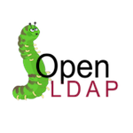

##LDAP NOTES - MONGODB BOOTCAMP

+++

### Resources

[github repo - https://github.com/manfontan/mongodb-bootcamp](https://github.com/manfontan/mongodb-bootcamp)  

[online slides - https://gitpitch.com/manfontan/mongodb-bootcamp](https://gitpitch.com/manfontan/mongodb-bootcamp)  

---

### What is LDAP?  
LDAP stands for Lightweight Directory Access Protocol.

+++

  - **L**: lightweight, why?
    - Even though the “lightweight” moniker is primarily intended as a comparison to its predecessor, the X.500 ([ISO/IEC 9594-1](http://www.itu.int/rec/T-REC-X.500-201210-S)) Directory Access Protocol, LDAP really is lightweight compared with just about any other TCP-based protocols.

+++

  - **D**: directory, what is it?
    - The Directory is "a collection of open systems cooperating to provide
 directory services"
    - A directory is a specialized database specifically designed for searching and browsing, in additional to supporting basic lookup and update functions.
    - [RFC 4512](https://tools.ietf.org/pdf/rfc4512.pdf)


Note: NoSQL database actually :).

+++

LDAP directory tree(traditional naming)  

+++?image=assets/intro_tree.png  

+++

DC tree  

+++?image=assets/intro_dctree.png

+++

  - **AP**: Access Protocol  
    - not server(implementation of the protocol) as many refer to it.  
    - [IETF](http://www.ietf.org/) Standard Track protocol and is specified in "Lightweight Directory Access Protocol (LDAP) Technical Specification Road Map" [RFC4510](http://www.rfc-editor.org/rfc/rfc4510.txt)  

    **Understand the protocol to solve server issues**


---

### Why Use LDAP?

+++  
  - Lightweight  

Note:
  2048 certs are ok, since they are renewed yearly. 4096 Certs slow the
  handshake process and might lead to issues.

+++  
  - Public Standard [rfc4510](https://tools.ietf.org/pdf/rfc4510.pdf)  
+++  
  - Mature  
+++  
  - Security  

---

### Understanding LDAP Schema  


+++

  - OIDs:  
    - [1.3.6.1.4.1.34601](https://www.iana.org/assignments/enterprise-numbers/enterprise-numbers)
    - [IANA](https://www.iana.org/about)  

Note:
who is this guy? well it is us :).  
IANA internet assigned numbers authority.

+++

  - There are a number of different types of elements that may comprise an LDAP schema. Every LDAP schema must include the following elements:

+++

  - **Attribute syntaxes** define the types of data that can be represented in a directory server.
    - Attribute type description, Bit String, Boolean, Generalized Time, JPEG...
    - ```( 1.3.6.1.4.1.1466.115.121.1.7 DESC ’Boolean’ )```
    - [RFC 4517](https://tools.ietf.org/pdf/rfc4517.pdf)

Note:  
Servers SHOULD recognize all the syntaxes listed in this document, but are not required to otherwise support them, and MAY recognise or support other syntaxes.  
This representation is referred to as the LDAP-specific encoding to distinguish it from other methods of encoding attribute values Ex. BER X.500.  
Clients MUST NOT assume that the LDAP-specific encoding of a value of an unrecognized syntax is a human-readable character string.

+++?image=assets/attributesyntax.png

+++

  - **Matching rules** define the kinds of comparisons that can be performed against LDAP data.  
    - uniqueMemberMatch, bitStringMatch, booleanMatch,...
    - [RFC 4517](https://tools.ietf.org/pdf/rfc4517.pdf)

Note:
A matching rule evaluates to TRUE, and in some cases Undefined, as specified in the description of the matching rule; otherwise, it evaluates to FALSE.

+++?image=assets/matchingrules1.png

+++?image=assets/matchingrules2.png

+++

  - **Attribute types** define named units of information that may be stored in entries.
      - [RFC 4519](https://tools.ietf.org/pdf/rfc4519.pdf)
      - 'cn','dc','member', 'o', 'ou', 'uniqueMember'...

Note:  
memberOf is not defined by the protocol.  
cn - country name, dc - domain component, organization, organization unit

+++

  - **Object classes** define named collections of attribute types which may be used in entries containing that class, and which of those attribute types will be required rather than optional.  
    - [RFC 4519](https://tools.ietf.org/pdf/rfc4519.pdf)
    - 'groupOfNames', 'groupOfUniqueNames', 'locality'...


---

### Some LDAP Operations

+++

### Bind Operation  

  The function of the Bind operation is to allow authentication
 information to be exchanged between the client and server.

+++

The **Bind operation** should be thought of as the **"authenticate"** operation.

  - *version*: no negotiation, if the server does not support the version will  
    send a protocolError on the BindResponse.

  - *name*: Name of the Directory Object that the client wants to bind as.  
     Empty for anonymous binds and SASL auth.

  - *authenticate*:
    - username passwords - UTF-8 -> [SASLprep](https://tools.ietf.org/pdf/rfc4013.pdf)

+++

### Unbind Operation

  The function of the Unbind operation is to terminate an LDAP session.
 The Unbind operation is not the antithesis of the Bind operation as
 the name implies. The naming of these operations are historical.
 The Unbind operation should be thought of as the **"quit"** operation.

+++

### Search Operation

---

### LDAP Data Interchange Format (LDIF)

+++

  - [RFC 2849](https://tools.ietf.org/pdf/rfc2849.pdf)

  - LDIF is typically used:
    - to import and export directory information between LDAP-based directory servers
    - to describe a set of changes which are to be applied to a directory.

+++

#### Update Openldap certs using ldif

```
## certs.ldif
dn: cn=config
changetype: modify
add: olcTLSCACertificateFile
olcTLSCACertificateFile: /etc/openldap/certs/mongodbca.crt
-
replace: olcTLSCertificateFile
olcTLSCertificateFile: /etc/openldap/certs/mongodbserver.crt
-
replace: olcTLSCertificateKeyFile
olcTLSCertificateKeyFile: /etc/openldap/certs/mongodbserver.key
```  
+++

```
# ldapmodify -Y EXTERNAL -H ldapi:/// -f certs.ldif
```
---

### LDAP flavors  
[Server implementations](https://en.wikipedia.org/wiki/List_of_LDAP_software#Server_software)

+++

Microsoft AD

+++



[Openldap](http://www.openldap.org/)

+++

389 Directory Server

+++


[OpenDJ](https://backstage.forgerock.com/docs/opendj/2.8.0/server-dev-guide/preface)

+++

ApacheDS


---

### MongoDB and LDAP

  - Authentication and Authorization
    - [M310 Chapter 1](https://university.mongodb.com/courses/MongoDB/M310/2017_ondemand_v32/courseware/Chapter_1_Authentication)
    - [M034 Chapter 3](https://university.mongodb.com/mercury/M034/2016_ondemand_v1/courseware/Chapter_3_LDAP_Authorization)
    - [Mongodb 3.4 LDAP docs](https://docs.mongodb.com/manual/core/security-ldap/)


---

### MongoDB LDAP Testing

+++

[Testing AD](https://wiki.mongodb.com/display/KB/Using+LDAP%2C+LDAPS+and+AD+for+Testing)

Note:
This is a AWS instance.

+++

[Drivers Openldap](https://wiki.mongodb.com/display/DI/Testing+LDAP)

Note:
This is a openldap server deployed on ny office, only accessible using the VPN.

+++

Training Vagrant files

+++

- Tools  
  - mongoldap
  - ldapsearch

+++

 - Understanding [MongoDB LDAP configuration](https://docs.mongodb.com/manual/core/security-ldap-external/#configuration)

+++

  - OM  

+++

  - Ask Emilio :)  

    [Ops Manager and LDAP](https://docs.google.com/presentation/d/1ka0gm-ErzcnwBFj_vcdLKC5Of_bKBhvx15TFaSWVJas/edit#slide=id.p4)  

+++?image=assets/emilio.png

---

  Figure 1.3: ldap message
+++?image=assets/intro_ldap_message.png

---

# Q&A

+++?image=assets/ricardo.png

+++

### Than you for your time

---

### References  

- [Lightweight Directory Access Protocol (LDAP)](https://tools.ietf.org/pdf/rfc4511.pdf)  
- [Mongodb 3.4 LDAP docs](https://docs.mongodb.com/manual/core/security-ldap/)  
- [IANA enterprise numbers](https://www.iana.org/assignments/enterprise-numbers/enterprise-numbers)  
- [mongoldap](https://docs.mongodb.com/manual/reference/program/mongoldap/)  
- [Basic LDAP Concepts](https://www.ldap.com/)  
- [Openldap Admin guide](http://www.openldap.org/doc/admin24/)  
- [List of LDAP software](https://en.wikipedia.org/wiki/List_of_LDAP_software#Server_software)  
- [GitPitch](https://github.com/gitpitch/gitpitch/wiki/Slide-Delimiters)  
- [Ops Manager and LDAP](https://docs.google.com/presentation/d/1ka0gm-ErzcnwBFj_vcdLKC5Of_bKBhvx15TFaSWVJas/edit#slide=id.p4)
